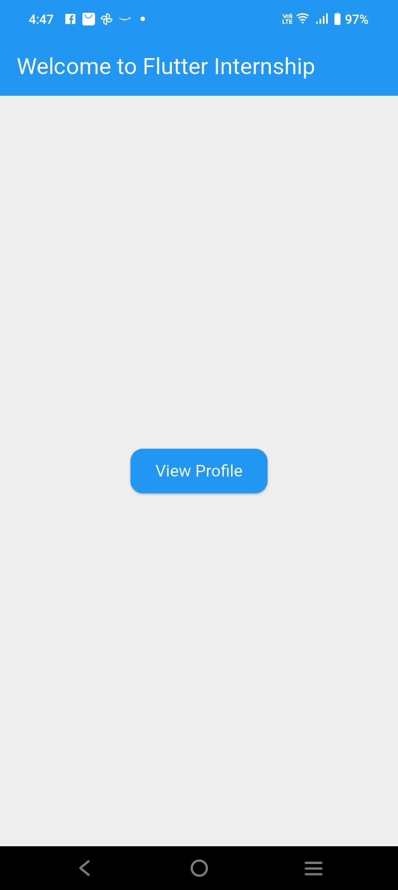
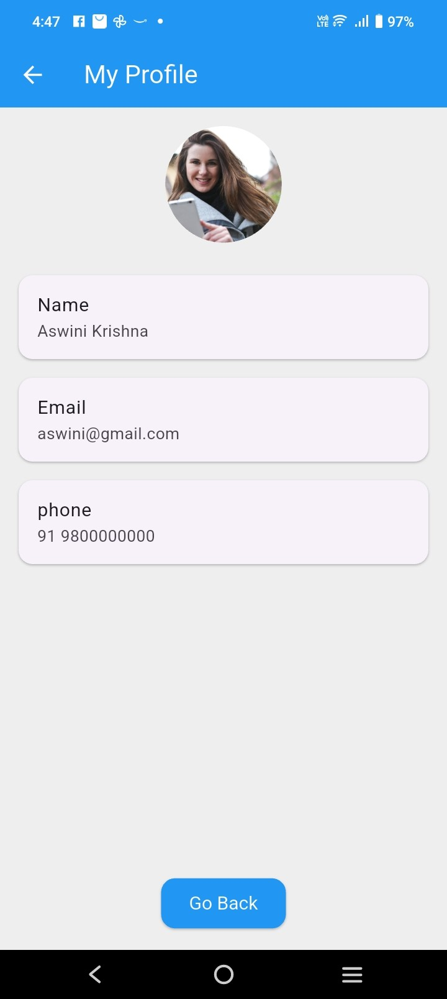

# Flutter_task -Profile App

A new Flutter project.

A simple Flutter application built as part of a Flutter Internship Task. This app demonstrates basic screen navigation, widget structuring, and dynamic data handling using model classes.

# Overview
The app consists of two main screens:

**Home Screen:**
 Displays a welcome message and a button to view the user's profile.

**Profile Screen:**
Shows user information including:
- Name
- Email
- Phone number
- Circular Profile picture
- "Go Back" button

Also includes:
- Loading spinner before navigation.
- Asset image usage

# Screenshot

**Home Screen**

**Profile Screen**
